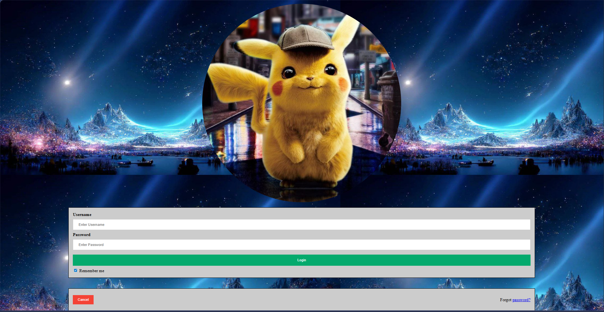

# Task 1: Login Page

A simple and interactive login page built with HTML and CSS.

## Overview
This is a login form interface that provides a user authentication page with a clean and modern design.

## Features
- Username/Email input field
- Password input field
- Login button
- Remember me checkbox
- Cancel button
- Forgot password link

## Files
- `login_page.html` - Main HTML file containing the login form

## Technologies Used
- HTML5
- CSS3

## How to Use
1. Open `login_page.html` in your web browser
2. Enter your username/email and password
3. Click the Login button to proceed

## Design Elements
- Responsive layout
- Clean user interface
- Easy-to-use form controls

## Output Screenshot

