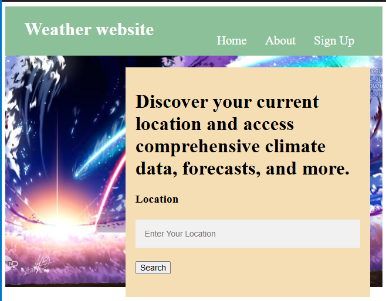

# Task 2: Weather App

A weather application that displays current location and climate data.

## Overview
This weather application allows users to discover their current location and access comprehensive climate data, forecasts, and weather information.

## Features
- Location-based weather information
- Current weather display
- Climate data and forecasts
- Search functionality for different locations
- Responsive design with attractive UI
- Real-time weather updates

## Files
- `Weather_Landing_page.html` - Main landing page with location search interface
- `Weather_home.css` - Stylesheet for the weather app

## Technologies Used
- HTML5
- CSS3
- JavaScript (for interactivity)

## How to Use
1. Open `Weather_Landing_page.html` in your web browser
2. Enter your location in the search field
3. Click the Search button to get weather data for that location
4. View comprehensive climate information and forecasts

## Design Features
- Beautiful gradient background
- User-friendly location input
- Clean and intuitive interface
- Responsive layout

## Output Screenshot

