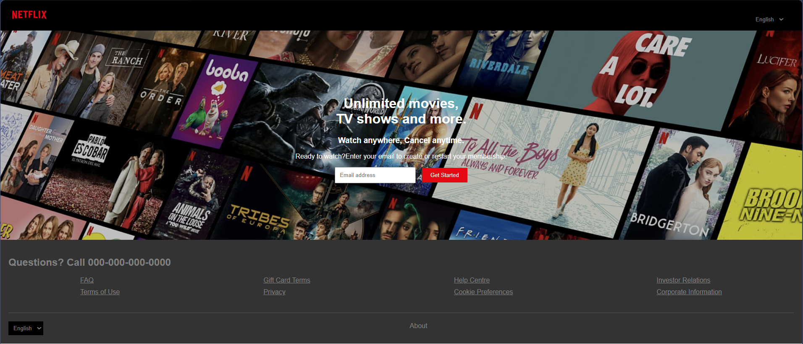
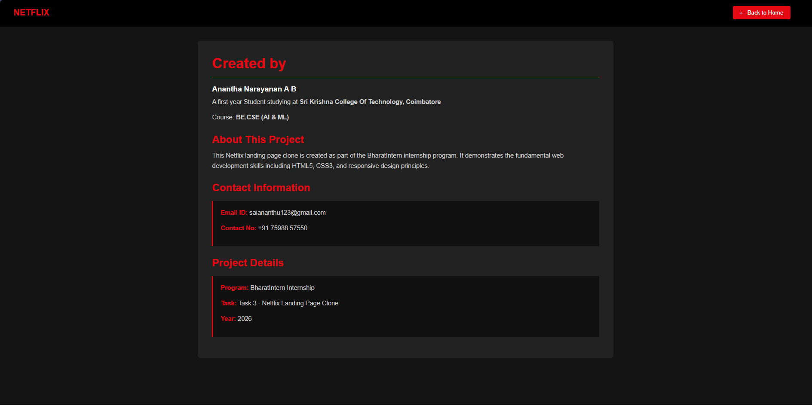

# Task 3: Netflix Landing Page

A Netflix-inspired landing page with navigation and content showcase.

## Overview
This project recreates the Netflix landing page design with a modern, professional layout featuring navigation, hero section, and additional information pages.

## Features
- Netflix-inspired design and styling
- Responsive navigation menu
- Hero section with call-to-action
- Content showcase area
- About page with detailed information
- Professional color scheme and typography
- Smooth user experience

## Files
- `Netflix_Home.html` - Main landing page
- `Netflix_Home.css` - Stylesheet for Netflix landing page
- `about.html` - About page with project information

## Technologies Used
- HTML5
- CSS3
- Responsive design principles

## How to Use
1. Open `Netflix_Home.html` in your web browser
2. Navigate through the menu to explore different sections
3. Click on the About link to learn more about the project
4. Enjoy the Netflix-inspired interface

## About This Project
This project was created as part of the BharatIntern internship program. It demonstrates:
- HTML structure and semantic markup
- CSS styling and layout techniques
- Responsive web design principles
- Professional UI/UX design implementation
- Navigation and page structure organization

## Author
BharatIntern Internship Program - Internee

## Purpose
This project serves as a portfolio piece showcasing web development fundamentals and design skills in creating a professional, modern landing page that closely mimics real-world web applications like Netflix.

## Output Screenshots

