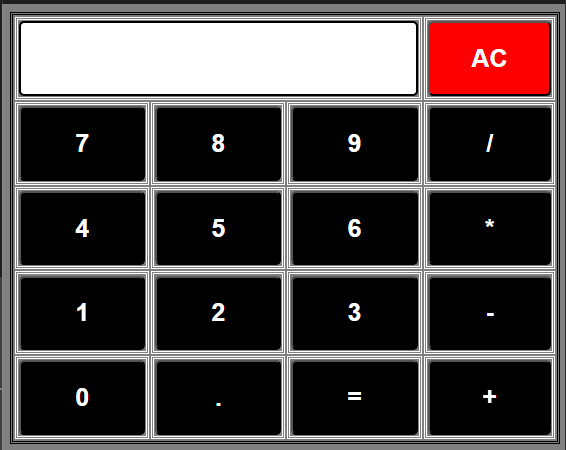

# 🧮 Calculator - CodSoft Task 1

## 🚀 Live Demo
A fully functional calculator built with HTML, CSS, and JavaScript that performs basic arithmetic operations.

## ✨ Features
- ➕ Addition
- ➖ Subtraction
- ✖️ Multiplication
- ➗ Division
- 🔢 Decimal point support
- 🧹 Clear (AC) function
- ⌨️ Keyboard support

## 🛠️ Technologies Used
- HTML5
- CSS3
- JavaScript
- Math.js library

## 📂 Files
- `index.html` - Main HTML structure
- `style.css` - Styling and layout
- `script.js` - Calculator logic and functionality

## 🎯 How to Use
1. Open `index.html` in your web browser
2. Click on numbers and operators to perform calculations
3. Press `=` to get the result
4. Use `AC` to clear the display

## 👨‍💻 Author
**Anantha Narayanan A B**  
CodSoft Internship - Web Development
