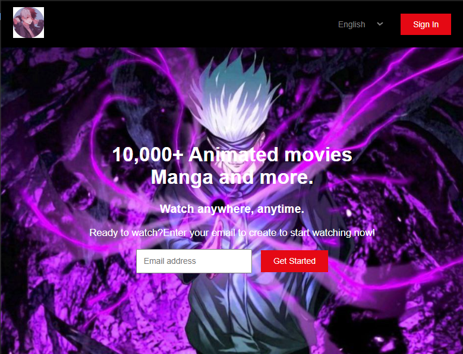

# 🎬 Anime Landing Page - CodSoft Task 2

## 🌟 Overview
An attractive landing page for an anime streaming platform featuring a modern design with hero section and call-to-action elements.

## ✨ Features
- 🎨 Eye-catching hero section with background image
- 🌐 Language selection (English/Japanese)
- 📧 Email subscription form
- 🎯 Clean and responsive design
- 🔘 Sign In button
- 💫 Professional UI/UX

## 🛠️ Technologies Used
- HTML5
- CSS3
- Responsive Design

## 📂 Files
- `index.html` - Main landing page structure
- `style.css` - Styling and layout
- `background.jpg` - Hero section background image

## 🎯 Key Sections
- Header with logo and language selector
- Hero section with compelling headline
- Email capture form with CTA button
- "10,000+ Animated movies, Manga and more" tagline

## 🚀 How to Use
1. Open `index.html` in your web browser
2. Explore the landing page design
3. Enter email to simulate subscription

## 👨‍💻 Author
**Anantha Narayanan A B**  
CodSoft Internship - Web Development
