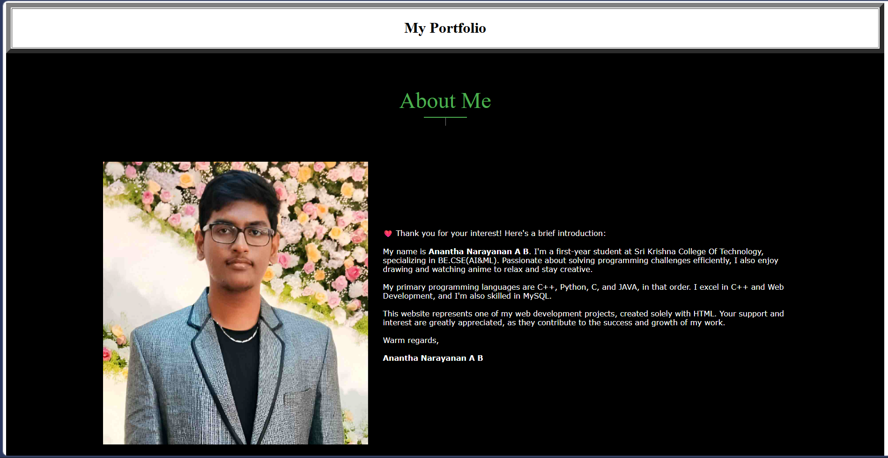
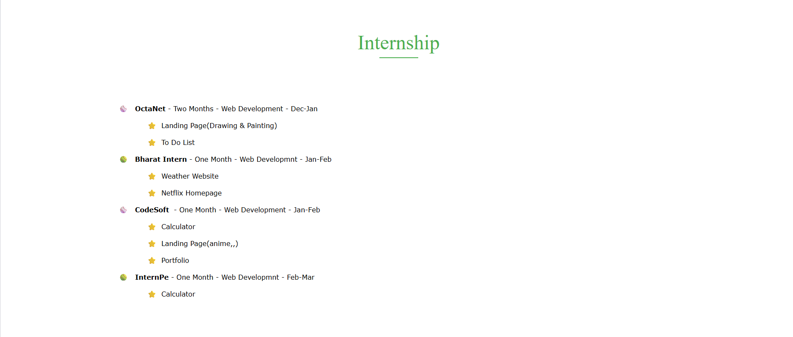
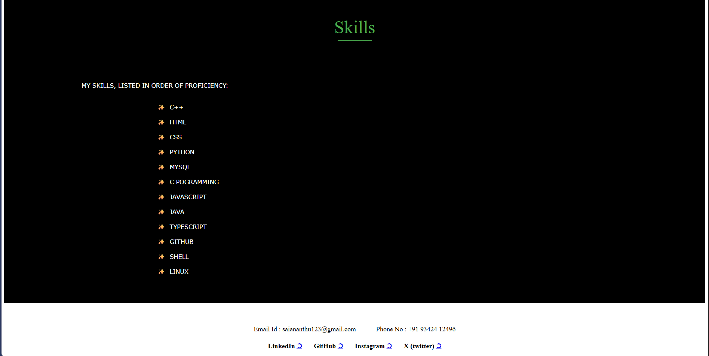

# 💼 Personal Portfolio - CodSoft Task 3

## 🌟 Overview
A comprehensive personal portfolio website showcasing skills, internships, and professional information built entirely with HTML.

## ✨ Features
- 👤 About Me section with profile picture
- 💼 Internship experience showcase
- 🛠️ Skills listing
- 📞 Contact information
- 🔗 Social media links (LinkedIn, GitHub, Instagram, X)
- 🎨 Clean table-based layout

## 🛠️ Technologies Used
- HTML5
- Table-based layout
- Custom styling with inline CSS

## 📂 Files
- `index.html` - Complete portfolio page
- `profile.jpg` - Profile picture

## 🎯 Sections Included
1. **About Me** - Personal introduction and background
2. **Internships** - Experience with OctaNet, Bharat Intern, CodSoft, and InternPe
3. **Skills** - Technical proficiencies (C++, HTML, CSS, Python, MySQL, etc.)
4. **Contact** - Email, phone, and social media links

## 📧 Contact Information
- **Email**: saiananthu123@gmail.com
- **Phone**: +91 93424 12496
- **LinkedIn**: [Profile Link](www.linkedin.com/in/anantha-ñarayanan-ankam-balaji-7057b5290)
- **GitHub**: [Darklord1987](https://github.com/Darklord1987)

## 🚀 How to Use
1. Open `index.html` in your web browser
2. Navigate through different sections
3. Click on social media links to connect

## 👨‍💻 Author
**Anantha Narayanan A B**  
BE.CSE (AI & ML) - Sri Krishna College Of Technology  
CodSoft Internship - Web Development
