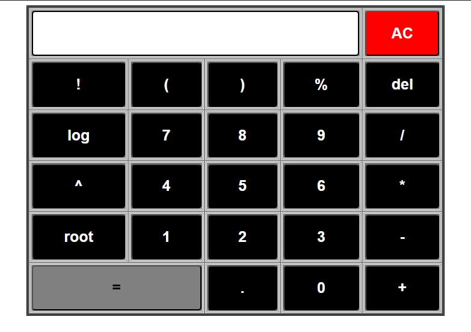

# Scientific Calculator

## Output Screenshot

## Description

A fully functional scientific calculator built with HTML, CSS, and JavaScript. This calculator provides basic arithmetic operations along with advanced scientific functions.

## Features

- Basic arithmetic operations (addition, subtraction, multiplication, division)
- Scientific functions (trigonometric, logarithmic, exponential)
- Clear and delete functionality
- Responsive design
- User-friendly interface

## Technologies Used

- HTML5
- CSS3
- JavaScript

## Files

- `Calculator.html` - Main HTML structure
- `Calculator.css` - Styling and layout
- `Calculator.js` - Calculator functionality and logic

## How to Use

1. Open `Calculator.html` in your web browser
2. Click on the buttons to perform calculations
3. Use the scientific functions for advanced operations
4. Clear button to reset the calculator

## Author

InternPe Internship Project - Task 1
