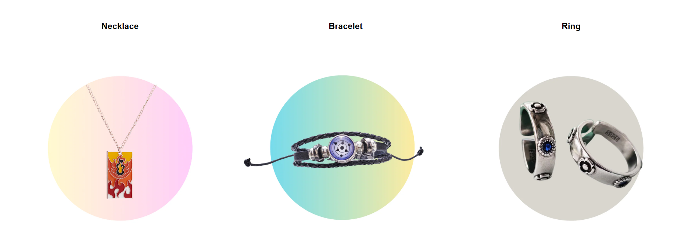
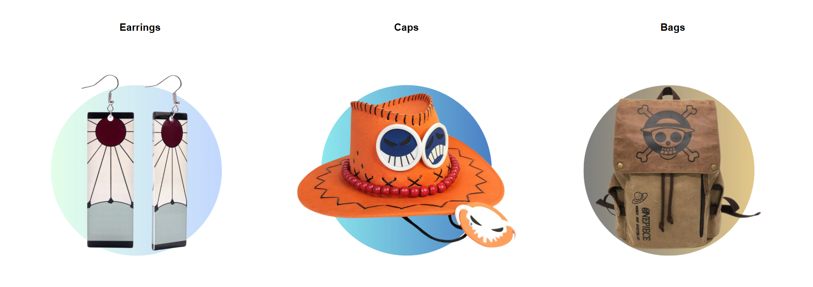
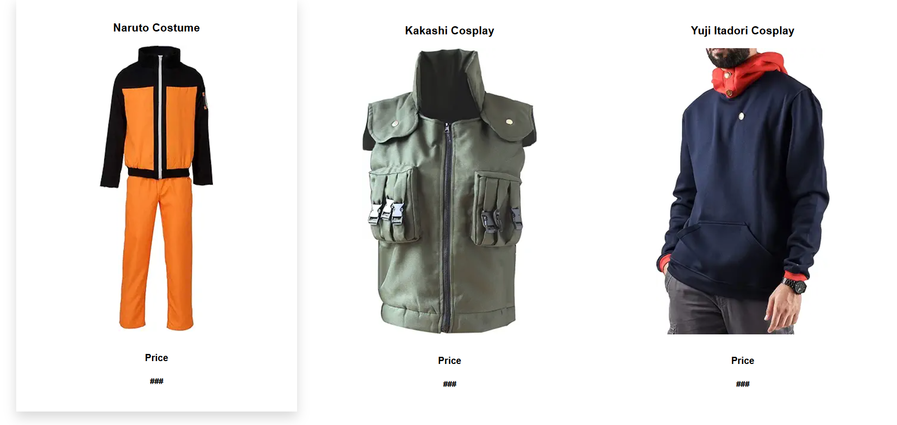
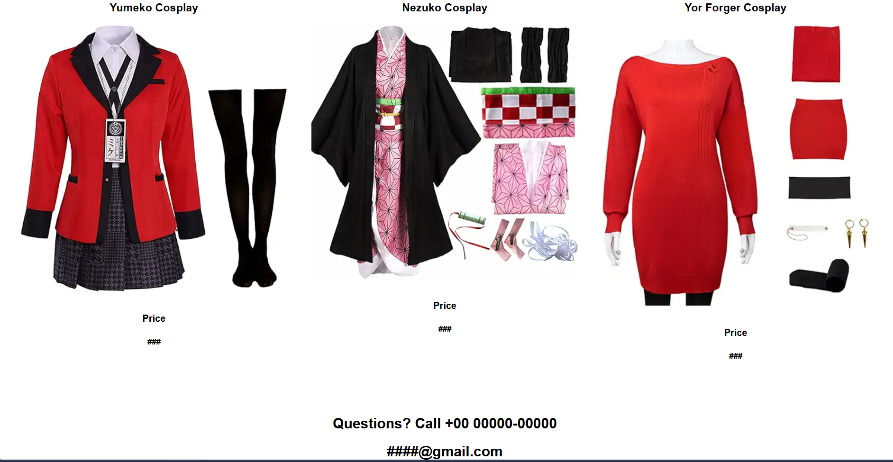

# E-Commerce Landing Page

## Output Screenshots

## Description

A modern and responsive e-commerce landing page designed to showcase products with an attractive user interface. The landing page features smooth animations and an engaging layout.

## Features

- Responsive design for all devices
- Modern and clean UI
- Product showcase sections
- Smooth scrolling and animations
- Custom branding with logo
- Video integration

## Technologies Used

- HTML5
- CSS3
- JavaScript

## Files

- `E_commerce.html` - Main HTML structure
- `E_commerce.css` - Styling and responsive design
- `e-commerceLOGO.jpeg` - Brand logo
- `e-commerce_sukuna.mp4` - Promotional video

## How to Use

1. Open `E_commerce.html` in your web browser
2. Browse through the landing page sections
3. Experience the responsive design by resizing the browser window

## Author

InternPe Internship Project - Task 2
