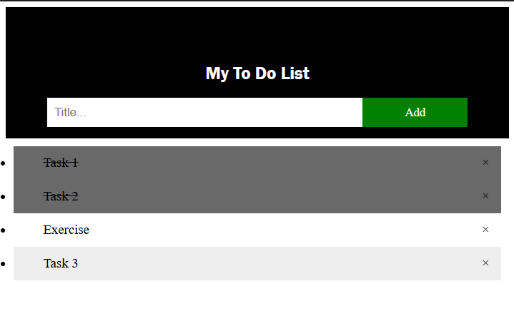

# To Do List Application

## Output Screenshot

## Description

A simple and intuitive to-do list application that helps users manage their daily tasks efficiently. Users can add, mark as complete, and delete tasks with ease.

## Features

- Add new tasks
- Mark tasks as completed
- Delete tasks
- Clean and minimal interface
- Persistent task list
- Interactive UI with hover effects

## Technologies Used

- HTML5
- CSS3
- JavaScript

## Files

- `TO_DO_LIST.html` - Main HTML structure
- `TO_DO_LIST.css` - Styling and layout
- `TO_DO_LIST.js` - Task management functionality

## How to Use

1. Open `TO_DO_LIST.html` in your web browser
2. Type a task in the input field
3. Click "Add" button to add the task to your list
4. Click on a task to mark it as completed
5. Click the delete button (×) to remove a task

## Author

InternPe Internship Project - Task 3
