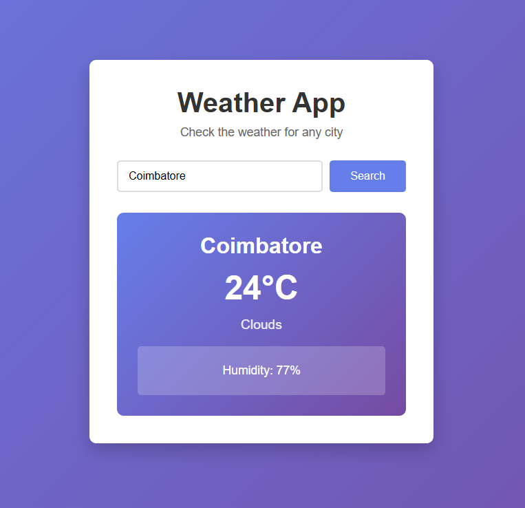

# Simple Weather App



A beginner-friendly weather website built using HTML, CSS, and JavaScript.

This project fetches real-time weather data using the OpenWeatherMap API and displays basic weather information for any city entered by the user.

## Features

- Search weather by city name
- Displays:
  - City name
  - Temperature (°C)
  - Weather description
  - Humidity
- Simple and clean UI
- Responsive design
- Beginner-level JavaScript (uses fetch() with .then())

## Technologies Used

- HTML
- CSS
- JavaScript (Vanilla JS)
- OpenWeatherMap API

## Project Structure

```
WeatherWebsite-main/
│
├── index.html
├── style.css
├── script.js
└── README.md
```

## How to Run the Project

1. Open terminal inside the project folder
2. Run the following command:

```
python -m http.server 8000
```

3. Open your browser and go to:

```
http://localhost:8000/index.html
```

## API Setup

1. Go to https://openweathermap.org/
2. Create a free account
3. Generate your API key
4. Replace the API key inside `script.js` with your own key

## Learning Purpose

This project is created for learning purposes to understand:
- API integration
- Fetching data using JavaScript
- DOM manipulation
- Basic frontend structure

---

Made as a beginner frontend project.
