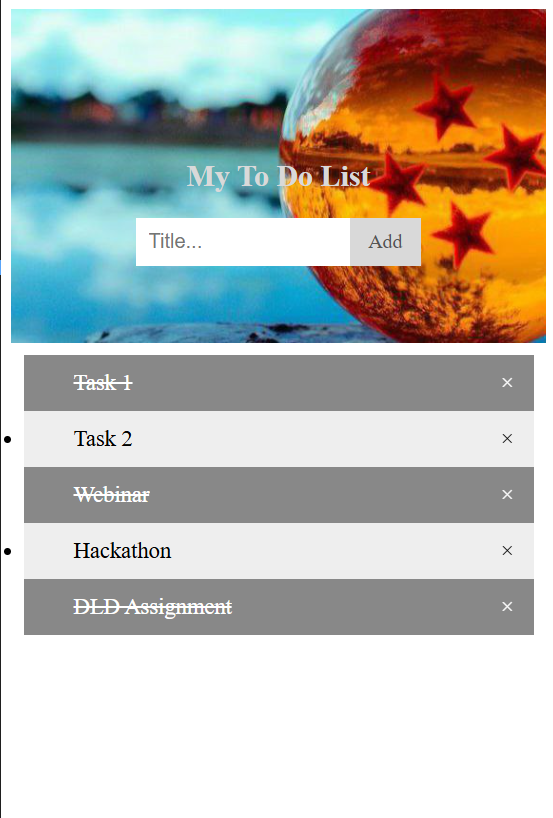

# 📝 To Do List Web App

A clean, interactive, and user-friendly to-do list application built with vanilla HTML, CSS, and JavaScript. Manage your daily tasks efficiently with a simple and intuitive interface.

---

## ✨ Features

- ✅ **Add Tasks** – Easily add new tasks to your to-do list
- 🎯 **Mark Complete** – Click any task to mark it as completed
- 🗑️ **Delete Tasks** – Remove tasks with the × button
- 🎨 **Beautiful UI** – Modern, responsive design with custom styling
- 📱 **Client-Side** – No server required; runs entirely in your browser
- ⚡ **Fast & Lightweight** – Instant task management without external dependencies

---

## 📸 App Preview



---

## 📁 Project Structure

```
OCTANET_JANUARY-task-2/
├── main.html           # HTML structure of the application
├── main.css            # Styling and layout
├── main.js             # JavaScript logic & functionality
├── Output.png          # App preview screenshot
├── background.jpg      # Background image asset
├── backgroundimg1.jpg  # Additional background image
├── profile.jpg         # Profile image asset
└── README.md           # Project documentation
```

---

## 🚀 Getting Started

### Prerequisites
- A modern web browser (Chrome, Firefox, Safari, Edge, etc.)
- No additional tools or installations needed!

### How to Use

1. **Open the Application**
   - Navigate to the project folder
   - Open `main.html` in your web browser

2. **Add a Task**
   - Type your task in the input field
   - Click the "Add" button or press Enter

3. **Manage Tasks**
   - **Mark as Complete** – Click on any task to toggle completion status
   - **Delete Task** – Click the × button next to a task to remove it

---

## 🛠️ Technologies Used

- **HTML5** – Semantic markup and structure
- **CSS3** – Modern styling and responsive design
- **Vanilla JavaScript** – Pure JS for interactivity (no frameworks)

---

## 📝 File Details

| File | Purpose |
|------|---------|
| `main.html` | Contains the HTML structure and semantic markup |
| `main.css` | Handles all styling, layout, and visual design |
| `main.js` | Implements task management logic (add, delete, complete) |
| `Output.png` | Preview screenshot of the application |

---

## 💡 Potential Enhancements

- 💾 **Local Storage** – Persist tasks even after closing the browser
- 🔍 **Search/Filter** – Find specific tasks quickly
- 🏷️ **Categories** – Organize tasks by category or priority
- 📅 **Due Dates** – Add deadlines to your tasks
- 🌙 **Dark Mode** – Toggle between light and dark themes
- 📊 **Statistics** – Track completed vs pending tasks

---

## 📦 Installation & Setup

Since this is a static web application, **no installation is required!**

Simply:
1. Clone or download this repository
2. Open `main.html` in your browser
3. Start managing your tasks!

---

## 🎨 Customization

- **Styling** – Edit `main.css` to change colors, fonts, and layout
- **Functionality** – Modify `main.js` to add new features
- **Structure** – Update `main.html` to add more elements or sections

---

## 📄 License

This project is open source and available for personal and educational use.

---

## 👤 Author

Created as part of the OCTANET January 2025 Task 2

---

## 💬 Support

For questions or suggestions, feel free to improve and customize the project!

Happy task managing! 🎯
